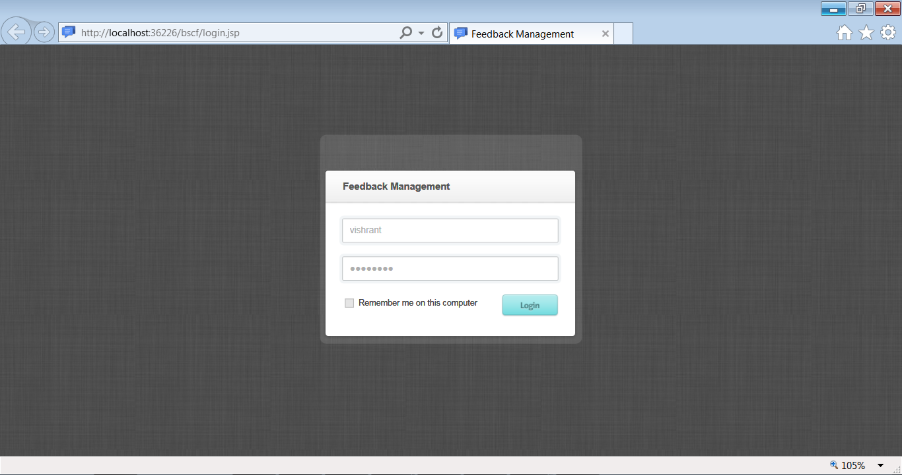
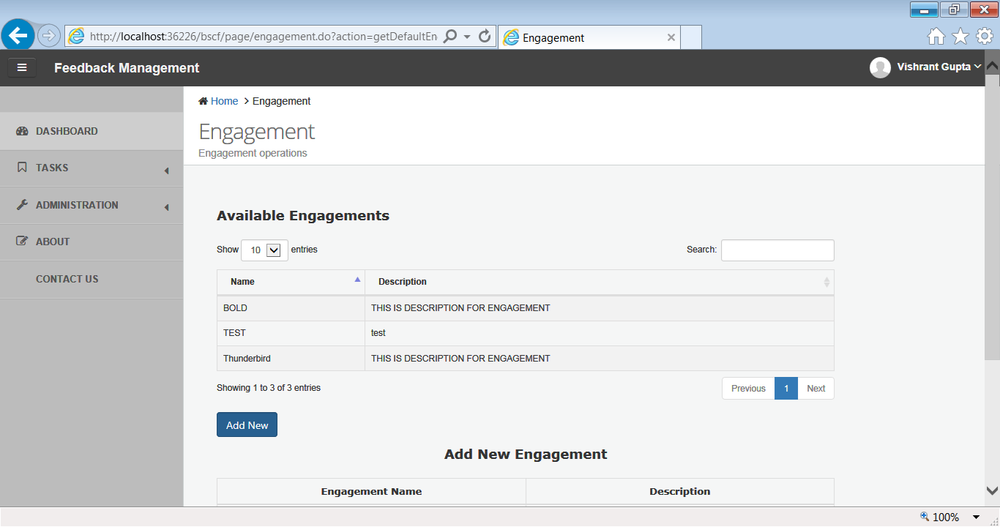
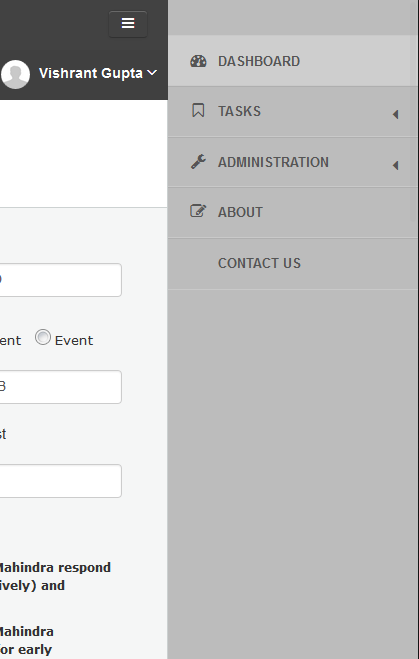
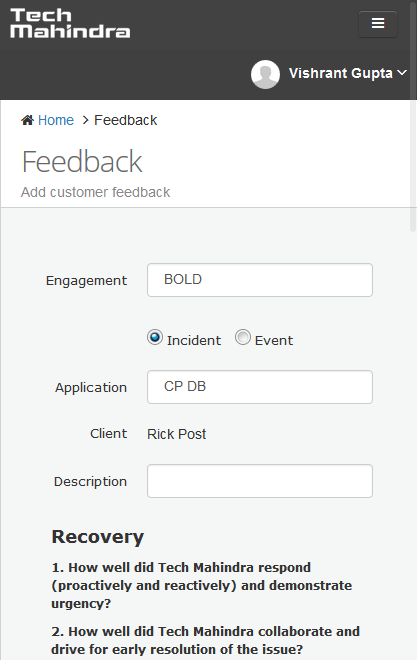

# CSAT and ADHOC Feedback System

A system to capture CSAT and ADHOC customer feedback built upon Android and browser based web application using J2EE, Struts, Hibernate, Bootstrap.

The snapshots of web applications are as follows:

Login

Engagement

Dashboard mobile view

Feedback mobile view

## Setup

This application requires following:
1. Tomcat server
2. JDK > 7
3. DNS configuration for android application to access backend server (for dynamic IP I would suggest to use [no-ip tool](https://www.noip.com/download?page=win), which is a dynamic DNS update client)
